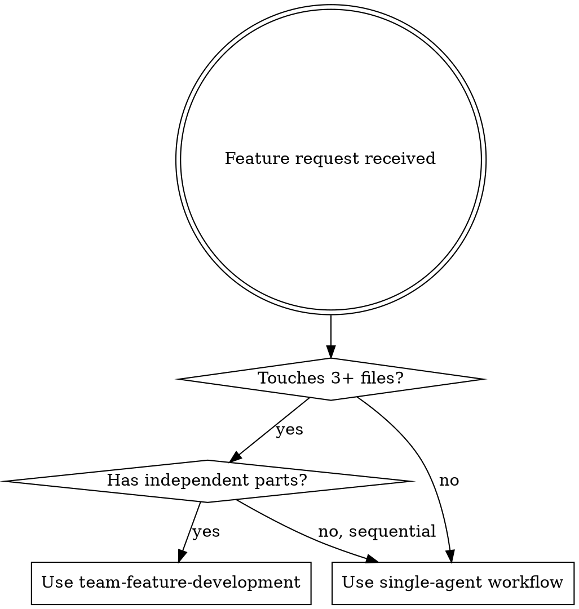

# Team Feature Development Orchestrator

## Overview

This skill coordinates Agent Teams for feature development, mapping each phase to the right superpowers skills and agent roles. The lead orchestrates, teammates execute, and existing skills enforce discipline at every step.

**Core principle:** The lead NEVER writes code directly. The lead brainstorms, plans, creates tasks, spawns teammates, assigns work, reviews results, and synthesizes. Teammates do the implementation.

## When to Use



**Use when:**
- Feature spans multiple modules (API + frontend + DB)
- 3+ independent tasks can run in parallel
- Multiple approaches need competitive exploration
- Feature needs both implementation and review in one flow

**Don't use when:**
- Single file change or small bug fix
- All tasks are sequential (each depends on the previous)
- Token budget is limited (teams cost N x single session)

## Team Size Decision

| Feature scope | Team size | Composition |
|---|---|---|
| 2 independent modules | 2 teammates | 1 per module |
| Full-stack feature (DB + API + UI) | 3 teammates | backend, frontend, tester |
| Full-stack + competitive research | 4 teammates | researcher, backend, frontend, reviewer |
| Large multi-module refactor | 4-5 teammates | 1 per module boundary |

**Rule:** Never spawn more than 5 teammates. Coordination overhead grows quadratically.

## Phases

### Phase 1: Brainstorming (Lead solo OR 2-3 research teammates)

**Skill:** `superpowers:brainstorming`

The lead explores user intent, requirements, and design before any implementation.

**Solo brainstorming** (default for clear requirements):
1. Lead invokes `Skill("superpowers:brainstorming")`
2. **Deep codebase exploration** (do NOT skip this — your plan quality depends on it):
   - **Start with DeepContext** (if available): use `mcp__deepcontext__query` to semantically search the codebase for concepts related to the feature. For example, if building "risk scoring", search for "score", "risk", "validator metrics", "cron job". This surfaces relevant files faster than manual browsing.
   - Read CLAUDE.md for project conventions, tech stack, and coding standards
   - Read AGENTS.md in every directory the feature will touch
   - Find and read existing code that does something similar to the requested feature
   - Identify existing patterns: service layer structure, API route conventions, component patterns, DB schema
   - Note reusable utilities, shared types, and helper functions already in the project
   - Use **Context7** (if available) for documentation of external libraries the feature depends on
   - Check recent git history for the affected area to understand current velocity and style
   The goal: you should know the codebase well enough to write accurate file paths and realistic acceptance criteria in Phase 2. If you skip this, your plan will reference nonexistent files and miss existing patterns.
3. Defines requirements and constraints
4. Produces spec document

**Competitive brainstorming** (for ambiguous requirements or multiple valid approaches):
1. Lead creates team: `TeamCreate({ team_name: "feature-{name}" })`
2. Creates research tasks — one per approach:
   ```
   TaskCreate("Research approach A: WebSockets for real-time updates")
   TaskCreate("Research approach B: SSE for real-time updates")
   TaskCreate("Research approach C: Polling for real-time updates")
   ```
3. Spawns researcher teammates (use `general-purpose` or `research-analyst` subagent_type)
4. Each researcher investigates one approach, finds pros/cons, checks codebase compatibility
5. Researchers message each other to challenge findings via `SendMessage`
6. Lead synthesizes results and picks the winning approach

**Output:** Spec document or clear decision on approach.

### Phase 2: Planning (Lead solo)

**Skill:** `superpowers:writing-plans`

The lead writes the implementation plan based on brainstorming output.

1. Lead invokes `Skill("superpowers:writing-plans")`
2. **Ground the plan in real code** — use what you learned in Phase 1:
   - Reference actual file paths from the codebase (not invented ones)
   - Follow existing naming conventions for new files
   - Reuse existing utilities and shared types instead of creating duplicates
   - Match the project's architecture patterns (if the project uses a service layer, your plan uses a service layer)
3. Breaks work into independent, parallelizable tasks
4. Identifies file ownership boundaries (CRITICAL: no two teammates edit the same file)
5. Defines task dependencies via `addBlockedBy`
6. Writes plan to a plan file

**Task structure rules:**
- Each task specifies: scope, files to touch, acceptance criteria
- Tasks that modify the same file MUST be sequential (use `addBlockedBy`)
- Tests are separate tasks from implementation
- Each task references which superpowers skill the teammate should use

**Output:** Plan with tasks ready for `TaskCreate`.

### Phase 3: Team Setup (Lead creates team + tasks)

1. Create team (if not created in Phase 1):
   ```
   TeamCreate({ team_name: "feature-{name}" })
   ```

2. Create all tasks from the plan:
   ```
   TaskCreate({
     subject: "Implement API endpoint for notifications",
     description: "Create GET /api/notifications endpoint in src/app/api/...\nFiles: src/app/api/notifications/route.ts\nFollow TDD: use skill superpowers:test-driven-development\nAcceptance: endpoint returns paginated notifications with proper types",
     activeForm: "Implementing notifications API"
   })
   ```

3. Set up dependencies:
   ```
   TaskUpdate({ taskId: "3", addBlockedBy: ["1", "2"] })
   ```

### Phase 4: Implementation (Teammates execute)

**Teammate skills:** `superpowers:test-driven-development` (for implementation tasks)

1. Lead spawns teammates with appropriate agent types:

   | Task type | subagent_type | Skills to use |
   |---|---|---|
   | Backend API / DB | `backend-developer` | `test-driven-development` |
   | Frontend components | `frontend-developer` | `test-driven-development`, `frontend-design` |
   | Full-stack module | `fullstack-developer` | `test-driven-development` |
   | Database schema | `backend-developer` | `test-driven-development` |
   | Bug investigation | `debugger` | `systematic-debugging` |

2. Spawn teammates with `team_name` and detailed prompts:
   ```
   Task({
     prompt: "You are a backend developer on team 'feature-notifications'.
              Check TaskList for available tasks. Claim unassigned tasks.
              For each implementation task, use the skill superpowers:test-driven-development.
              Follow CLAUDE.md project conventions.
              Mark tasks completed when done, then check TaskList for next work.
              Message the lead when blocked or when all your tasks are done.",
     subagent_type: "backend-developer",
     team_name: "feature-notifications",
     name: "backend-dev"
   })
   ```

3. Lead monitors progress:
   - Check `TaskList` periodically
   - Read teammate messages (delivered automatically)
   - Redirect approaches that aren't working via `SendMessage`
   - Resolve blockers by creating new tasks or providing guidance

4. **Conflict prevention:**
   - If two teammates need the same file, create a coordination task
   - Use `addBlockedBy` to serialize conflicting work
   - Lead mediates via `SendMessage` when conflicts arise

### Phase 5: Review (Reviewer teammate)

**Skill:** `superpowers:requesting-code-review`

1. When implementation tasks are complete, lead spawns a reviewer:
   ```
   Task({
     prompt: "You are a code reviewer on team 'feature-notifications'.
              Review all changes made by the team using git diff against main branch.
              Use skill superpowers:requesting-code-review.
              Check for: security issues, code quality, project conventions (CLAUDE.md),
              localization (all 3 locale files), accessibility, performance.
              Create new tasks for any issues found.
              Message the lead with your review summary.",
     subagent_type: "code-reviewer",
     team_name: "feature-notifications",
     name: "reviewer"
   })
   ```

2. If reviewer creates fix tasks:
   - Lead assigns them to implementation teammates
   - Teammates apply fixes using `superpowers:receiving-code-review`
   - Reviewer re-reviews after fixes

### Phase 6: Verification (Lead)

**Skill:** `superpowers:verification-before-completion`

1. Lead invokes `Skill("superpowers:verification-before-completion")`
2. Runs `yarn lint` and `yarn build`
3. Verifies all localization files updated (en.json, pt.json, ru.json)
4. Checks git diff for unintended changes
5. Confirms all tasks marked completed in TaskList

### Phase 7: Completion (Lead)

**Skill:** `superpowers:finishing-a-development-branch`

1. Lead invokes `Skill("superpowers:finishing-a-development-branch")`
2. Sends `shutdown_request` to all teammates
3. Waits for teammates to acknowledge shutdown
4. Deletes team: `TeamDelete()`
5. Presents options to user: commit, PR, or further work

## Communication Patterns

### Lead to Teammate
```
SendMessage({
  type: "message",
  recipient: "backend-dev",
  content: "The notifications table schema is approved. Proceed with the API endpoint. Use the existing pagination pattern from src/app/services/chain-service.ts.",
  summary: "Schema approved, proceed with API"
})
```

### Teammate to Lead (status update)
Teammates send messages automatically when:
- Task completed → mark via TaskUpdate, then message lead
- Blocked → message lead with blocker description
- Question → message lead for clarification

### Peer-to-Peer (teammate to teammate)
```
SendMessage({
  type: "message",
  recipient: "frontend-dev",
  content: "API response shape is: { data: Notification[], total: number, page: number }. TypeScript type is in src/types/notifications.ts.",
  summary: "Sharing API response shape"
})
```

### Broadcast (use sparingly)
Only for critical blockers affecting everyone:
```
SendMessage({
  type: "broadcast",
  content: "STOP: Found breaking change in prisma schema. Wait for migration before continuing.",
  summary: "Breaking schema change — pause work"
})
```

## File Ownership Matrix

Before spawning teammates, assign file ownership to prevent conflicts:

```
| Teammate     | Owns                              | Does NOT touch         |
|-------------|-----------------------------------|------------------------|
| backend-dev  | src/app/api/*, src/actions/*      | src/app/[locale]/components/* |
| frontend-dev | src/app/[locale]/components/*     | src/app/api/*, prisma/* |
| db-dev       | prisma/*, src/app/services/*      | src/app/[locale]/*     |
| tester       | __tests__/*, *.test.ts            | production code        |
```

Include this in each teammate's spawn prompt.

## Error Handling

| Situation | Action |
|---|---|
| Teammate stuck > 5 min on one task | Message them with guidance or reassign task |
| Two teammates edited same file | Lead resolves conflict manually, message both |
| Build fails after integration | Spawn debugger teammate with `systematic-debugging` |
| Teammate produces low-quality code | Reviewer creates fix tasks, lead reassigns |
| All tasks blocked | Lead investigates dependency chain, unblocks manually |

## Checklist

Before starting:
- [ ] Feature requirements are clear (brainstorm first if not)
- [ ] Plan written with independent, parallelizable tasks
- [ ] File ownership assigned — no overlaps
- [ ] Task dependencies defined via `addBlockedBy`
- [ ] Team size chosen (2-5 teammates)

During execution:
- [ ] Lead monitors TaskList every few minutes
- [ ] Teammates using correct superpowers skills (TDD, debugging, etc.)
- [ ] No file conflicts between teammates
- [ ] Blockers resolved promptly

Before completion:
- [ ] All tasks marked completed
- [ ] `yarn lint` passes
- [ ] `yarn build` passes
- [ ] All 3 locale files updated (if user-facing text added)
- [ ] Git diff reviewed for unintended changes
- [ ] Teammates shut down gracefully
- [ ] Team cleaned up via `TeamDelete()`